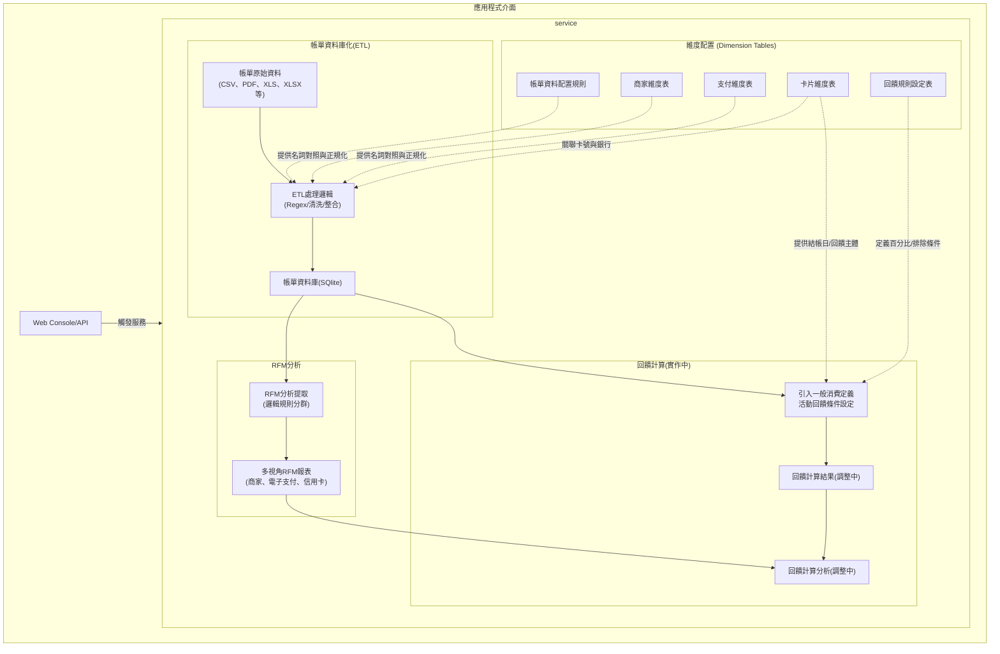

# 💳 Credit Card Transaction ETL Pipeline

## 📖 專案背景 (Project Context)
1. 為了理解"我是如何使用信用卡"，像是我會在什麼樣的消費情境下會使用信用卡，以及我對於回饋的偏好來改進我的信用卡使用配置和消費策略。

2. 最初使用 Excel 配合公式和Vloopup、Xlookup和樞紐分析表來整理。伴隨著信用卡的申辦張數增加、獲得不同發卡銀行的信用卡，以及各種回饋比較狀況下，Excel變得難以維持，因此透過AI工具輔助開發程式自動化資料清理和整理資料，以維持對消費情境的解析能力和回饋最佳化策略。

3. 面臨的挑戰與痛點：在嘗試將整理邏輯的過程中，發現帳單整合會遇到很多問題：
*   Data Consistency (數據一致性): 支付通路或商家名稱會因不同銀行帳單而異，導致消費明細格式多樣、極難歸一化。

*   Scalability (擴充性瓶頸): 隨著卡片張數增加、回饋規則變動、以及觀察商家狀態、校對回饋以及資料儲存的時間成本呈幾何級數增長，Excel 已難以負荷複雜的邏輯。

*   Privacy Risks (隱私安全風險): 將高度敏感的財務與消費數據上傳至第三方伺服器，即使已有強大的雲端 LLM (大型語言模型) API 可用於解析非結構化帳單，仍存在極大的隱私外洩疑慮。

*   Contextual Limitation (情境解析限制): 依賴記帳軟體進行分類或整理，會失去對消費行為的深度解析能力，進而無法得到個人化的消費最佳化策略。

3. 基於上述痛點，本專案建立了一個 Local-First ETL Pipeline，並有以下特色：

*   Zero-Cloud Logic(零雲端): 所有原始 CSV 帳單解析、資料清洗與資料庫儲存均在本地端獨立完成。

*   Rule Segregation(規則分離)：將包含個人資訊的邏輯進行脫敏處理與通用代碼分離，確保專案能安全地展示於公開的 GitHub 儲存庫。

透過此架構，系統不僅能支援後續的 RFM 模型 與 回饋最佳化 分析，更能透過RFM模型跟回饋計算的結果來提供個人化的消費策略建議。

---

## 🚀 快速上手 (Quick Start)

   1. **環境設定**：`pip install -r requirements.txt`
   2. **準備資料**：將銀行 CSV 帳單明細匯出後，放入 `data/` 資料夾。
   3. **啟動分析介面**：`python -m api.server` (訪問 http://localhost:5000)
   4. **執行 ETL**：透過 Web 介面點擊執行，或手動執行 `python main.py`。

---

### 系統架構與資料流程 (System Architecture)
    本專案採用服務化架構 (Service-Oriented Architecture)，透過 ETL流程將原始帳單轉換為結構化資料，並結合維度配置進行 RFM 分析與回饋計算。



---

## 🛠️ 開發方法論 (Development Methodology)

本專案採用 **AI 輔助開發 (AI-Assisted Development)** 模式，結合人類架構師的邏輯與 LLM 的算力。

* **Architecture (人類主導):** 定義資料流 (Data Flow)、Schema 設計、隱私邊界與專案目標。
* **Implementation (AI 加速):** 使用Gemini Pro模型生成 Python、C# 語法，整理繁瑣的 Regex 規則和形成解析器樣板，大幅提升開發效率。
* **Verification (嚴格審查):** 所有生成代碼皆經過 Code Review，並通過真實數據的邏輯校驗，確保前後產出一致性；同時嚴格規範變數命名，維持代碼庫的穩定與可讀性。

---

## 📂 檔案結構 (File Structure)

```text
.
My-Credit-Card-ETL/
│
├── .gitignore                  #
├── README.md                   # 介紹文件
├── requirements.txt            # [環境] 專案相依套件清單
├── main.py                     # [入口點] 核心 ETL 流程控制器
├── const.py                    # [規範] 全域欄位定義與資料型態 (Single Source of Truth)
│   
├── api/
│   └── server.py               # [本機端伺服器] 
│ 
├── services/                   # [服務層] 負責呼叫服務對應的解析層、處理層
│   ├── billing_service.py      # 服務：帳單關聯設定檢查
│   ├── config_service.py       # 服務：帳單關聯，提取分析帳單的相關設定資料        
│   ├── etl_service.py          # 服務：帳單資料清洗並產生SQLite資料庫
│   ├── rfm_service.py          # 服務：從SQLite資料庫提取RFM分析要用的資料，並產生多視角報表
│   ├── reward_service.py       # 服務：從SQLite資料庫提取回饋計算要用的資料
│   └── transaction_service.py  # 服務：提取符合條件的交易資料
│  
├── parsers/                    # [解析層] 負責各銀行原始帳單轉為標準 DataFrame
│   ├── base.py                 # Parser 基類，定義統一介面
│   ├── cathay.py               # 國泰世華 (csv) 解析邏輯
│   ├── esun.py                 # 玉山銀行 (csv) 解析邏輯
│   ├── CTBC.py                 # 中國信託 (csv) 解析邏輯
│   ├── sinopac.py              # 永豐銀行 (PDF) 解析邏輯
│   └── hncb.py                 # 華南銀行 (格式偽裝) 解析邏輯
│
├── processors/                 # [處理層] 負責資料清洗、分類與商家對齊
│   ├── refiner.py              # 清洗總指揮，協調各子處理器
│   ├── classifier.py           # 自動標記交易類別 (一般、國外、退刷、繳款)
│   ├── merchant.py             # 商家名稱清洗與正規化
│   ├── mapper.py               # 欄位對應處理
│   └── rewards.py               # 回饋計算處理
│
├── loaders/                    # [載入層] 負責資料儲存、載入設定檔資料
│   ├──bills_to_db.py           # 將清洗好的帳單資料存入Bills.db
│   ├──sync_configs_to_db.py    # 將整理好的設定資料存入Configs.db
│   ├──schema_enforcer.py       # 匯入型別規則已確認資料型態是否指定，阻止針對資料型態的預測
│   ├──sqlite_loader.py         # 將資料匯入 SQLite (Bills.db、Configs.db) 
│   └──config_loader.py         # 將相關的設定資料匯入主程式執行
│
├── analytics/                  # [分析層] 負責進階數據建模
│   ├── run_rfm.py              # RFM 分析執行腳本
│   ├── rfm_modules.py          # RFM 計算引擎 (Merchant/Payment/Card)
│   ├── rfm_utils.py            # RFM 計算核心
│   └── run_rewards.py          # 回饋金計算執行腳本
│
├── configs/                            # [設定檔資料夾] 
│   ├── db_columns_mapping.py           # [設定檔] 資料庫欄位映射定義
│   ├── dim_cards.csv                   # [設定檔] 真實卡號放置地點(已在 .gitignore)
│   ├── transaction_types.yaml          # [設定檔] 銀行交易類別，排除持卡人跟銀行的交易像繳款、折抵/回饋、費用(手續費/服務費)(公開)
│   ├── dim_category.yaml               # [設定檔] 商家分類
│   ├── dim_merchants.csv               # [設定檔] 交易地點，使用Regex(正則表達式)-Replacement來清洗消費明細
│   ├── dim_ec_platforms.csv            # [設定檔] 電商平台，使用Regex(正則表達式)-Replacement來清洗消費明細
│   ├── dim_payment_process.csv         # [設定檔] 支付/處理流程，使用Regex(正則表達式)-Replacement來整理支付通路(公開)
│   ├── dim_card_rewards_base.csv       # [設定檔] 基本回饋設定(已在 .gitignore)
│   ├── dim_card_rewards_campaigns.csv  # [設定檔] 消費活動回饋設定(已在 .gitignore)
│   ├── bridge_reward_rules.csv         # [設定檔] 基本回饋設定橋接表(已在 .gitignore)
│   ├── bridge_cube_selections.csv      # [設定檔] Cube權益切換橋接表(已在 .gitignore)
│   ├── dim_FX_Table.csv                # [設定檔] 銀行外幣牌告匯率表，供外幣消費回饋計算使用
│   └── dim_billing_history.csv         # [設定檔] 結帳日歷史資料，回饋計算參考資料
│
├── data/                       # [帳單csv放置處] 真實的 CSV 帳單放這邊。
│   └── (各銀行帳單)
│
├── database/                   # [資料庫放置處] 真實的 SQLite 資料庫放這邊。
│   └── (Bills.db、Configs.db)
│
└── output/                     # [輸出區] 存放 Bills.db、Configs.db 與 分析報表 (已在 .gitignore)

```

---

## 🚀 未來演進與重構計畫 (Future Roadmap)
隨著管線支援的銀行與信用卡數量增加，初期的「分散式維度設定檔」（將帳單解析規則、卡片資訊、回饋條件分別存放）已逐漸產生維護上的冗餘。為此，下一階段的系統架構將進行以下重構：

*   提升擴充效率：
        透過統一的資料庫關聯，未來新增銀行或卡片時，可實現單一入口 (Single Point of Entry) 的設定，大幅降低設定檔維護的時間成本，並確保 ETL 處理與回饋計算引擎提取參數時的一致性。

*   瀑布式回饋引擎調整：
    *   回饋適用順序跟計算結果，進行資料庫化的處理
    *   若回饋週期依據帳單結帳週期的話，利用結帳日管理表來撈取資料計算回饋。

*   交易類型整理：
    *   依據事先設定好的交易分類整理，以提供RFM分析跟回饋獲取的場景偏好

*   前端網頁改善：
    *   卡片邏輯跟銀行邏輯連動：勾選銀行邏輯時會一起勾選對應的卡片和回饋邏輯。

*   模擬資料設置：
    *   透過公開的模擬資料來模擬市場上主流卡片的回饋分析。


### 支援銀行擴充
- [x] **玉山銀行**：已完整支援 (含 e.Point 折抵處理、多卡號歸戶邏輯)
- [x] **國泰世華**：已完整支援 (含 Cube 卡多卡號歸戶邏輯)
- [x] **中國信託**：已完整支援 
- [x] **華南銀行**：已完整支援 (含 副檔名偽裝、多卡號歸戶邏輯)
- [X] **永豐銀行**：已完整支援
- [ ] **台新銀行**：徵求 CSV 格式樣本 (Help Wanted)
- [ ] **台北富邦**：徵求 CSV 格式樣本 (Help Wanted)


