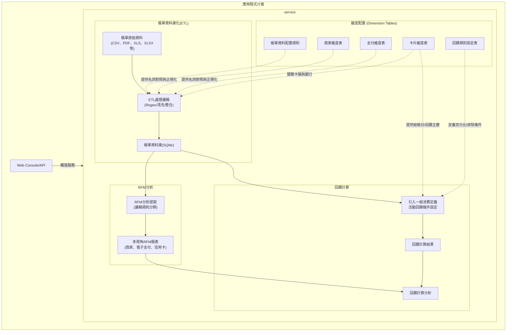

# 💳 Credit Card Transaction ETL Pipeline

[](https://github.com/<帳號>/<專案>/actions/workflows/ci.yml)

## 📖 專案背景 (Project Context)
1. 為了理解"我是如何使用信用卡"，像是我會在什麼樣的消費情境下會使用信用卡，以及我對於回饋的偏好來改進我的信用卡使用配置和消費策略。

2. 最初使用 Excel 配合公式和Vloopup、Xlookup和樞紐分析表來整理。伴隨著信用卡的申辦張數增加、獲得不同發卡銀行的信用卡，以及各種回饋比較狀況下，Excel變得難以維持，因此透過AI工具輔助開發程式自動化資料清理和整理資料，以維持對消費情境的解析能力和回饋最佳化策略。

3. 同時在生活環境遭遇實際信用卡配合電子支付、信用卡、電子票證的使用情境，以及多樣化的商家配合信用卡的回饋機制與優惠活動，因此產生了製作更精細的消費分析系統的需求。

4. 在嘗試將整理邏輯的過程中，發現帳單整合會遇到很多問題：
    *   Data Consistency (數據一致性): 支付通路或商家名稱會因不同銀行帳單而異，導致消費明細格式多樣、極難歸一化。
    *   Scalability (擴充性瓶頸): 隨著卡片張數增加、回饋規則變動、以及觀察商家狀態、校對回饋以及資料儲存的時間成本呈幾何級數增長，Excel 已難以負荷複雜的邏輯。
    *   Privacy Risks (隱私安全風險): 將高度敏感的財務與消費數據上傳至第三方伺服器，即使已有強大的雲端 LLM (大型語言模型) API 可用於解析非結構化帳單，仍存在極大的隱私外洩疑慮。
    *   Contextual Limitation (情境解析限制): 依賴記帳軟體進行分類或整理，會失去對消費行為的深度解析能力，進而無法得到個人化的消費最佳化策略。

5. 基於上述狀況，本專案建立了一個 Local-First ETL Pipeline，並有以下特色：
    *   Zero-Cloud Logic(零雲端): 所有原始 CSV 帳單解析、資料清洗與資料庫儲存均在本地端獨立完成。
    *   Rule Segregation(規則分離)：將包含個人資訊的邏輯進行脫敏處理與通用代碼分離，確保專案能安全地展示於公開的 GitHub 儲存庫。

透過此架構，系統不僅能支援後續的 RFM 模型 與 回饋最佳化 分析，更能透過RFM模型跟回饋計算的結果來提供個人化的消費策略建議。

---

## 🚀 快速上手 (Quick Start)
想要快速體驗「帳單 ETL 解析 ➔ 規則維度同步 ➔ RFM 分析 ➔ C# 瀑布式回饋試算」的完整流程，請參閱詳細的步驟說明：
👉 **[⚡ 快速上手指南 (Quick Start Guide)](docs/QUICKSTART.md)**
內含：
- 🛠️ 環境需求與相依套件安裝
- 🎭 一鍵生成四大銀行脫敏範例帳單 (`generate_mock_data.py`)
- 🌐 Web 視覺化控制台與 CLI 互動模式執行步驟
- 🔒 如何切換為個人私有 Profile 分析真實帳單
---

### 系統架構與資料流程 (System Architecture)
    本專案採用服務化架構 (Service-Oriented Architecture)，透過 ETL流程將原始帳單轉換為結構化資料，並結合維度配置進行 RFM 分析與回饋計算。



---

## 🛠️ 開發方法論 (Development Methodology)

本專案採用 **AI 輔助開發 (AI-Assisted Development)** 模式，結合人類架構師的邏輯與 LLM 的算力。

* **Architecture (人類主導):** 定義資料流 (Data Flow)、Schema 設計、隱私邊界與專案目標。
* **Implementation (AI 加速):** 使用Gemini Pro模型生成 Python、C# 語法，整理繁瑣的 Regex 規則和形成解析器樣板，大幅提升開發效率。
* **Verification (嚴格審查):** 所有生成代碼皆經過 Code Review，並通過真實數據的邏輯校驗，確保前後產出一致性；同時嚴格規範變數命名，維持代碼庫的穩定與可讀性。

---

# 專案目錄結構與模組架構說明 (File Structure & Architecture)

## 📌 一、專案全域目錄樹 (Directory Tree)
```text
.
My-Credit-Card-ETL/
│
├── .gitignore                  #
├── README.md                   # 介紹文件
├── requirements.txt            # [環境] 專案相依套件清單
├── main.py                     # [入口點] 核心 ETL 流程控制器
├── const.py                    # [規範] 全域欄位定義與資料型態 (Single Source of Truth)
│   
├── api/
│   ├── server.py               # web進入點
│   └── routers/                # 各服務 API 進入點 
│
├── database/                   # [資料庫層] 負責與資料庫進行互動
│   ├── database_api.py         # 模組轉接點        
│   └── loaders/                # 資料庫相關的載入與管理
│
├── etl/                        # [ETL 資料處理層] 跨銀行帳單提取、洗滌與視圖管理
│   ├── etl_api.py              # ETL 流程控制器 (Facade API)
│   ├── etl_extraction.py       # 原始帳單檔案掃描與解析調度
│   ├── etl_transformation.py   # 商家/支付管道交叉洗滌與正規化
│   ├── views_manager.py        # PostgreSQL / SQLite 視圖建立與維護
│   ├── utils.py                # 欄位標準化常數定義
│   ├── parsers/                # 各銀行專用 Parser (玉山、國泰、中信、富邦、台新、星展等)
│   └── processors/             # 商家正規化、支付管道、交易類型分類處理器
│
├── analytics/                  # [分析與模型層] 多時間視窗 RFM 客群與消費矩陣
│   ├── api.py                  # 分析模組統一進入點 (run_analytics)
│   ├── common/                 # 共用資料提取、過濾與排名工具
│   ├── rfm/                    # 商家、消費類別、支付方式、信用卡四大維度 RFM
│   └── matrix/                 # 三層支付管道 × 消費類別之消費矩陣 (Spending Matrix)
│
├── profiles/                   # [設定檔與規則層] 個人化與公開規則分離管理
│   ├── profiles_api.py         # 設定檔同步進入點
│   ├── common/configs/         # 公開通用設定 (dim_banks, dim_payment_process 等)
│   ├── example_public/         # 公開範例 Profile
│   ├── loaders/                # ConfigLoader (支援雙層疊加與 JSON/YAML 載入)
│   └── user_main/              # 個人私有設定檔 (已透過 .gitignore 排除)
│
├── web/                        # [前端介面層] 原生 Vanilla HTML/CSS/JS 控制台
│   ├── index.html              # 總控制台首頁
│   ├── etl.html                # 帳單 ETL 處理面板
│   ├── rfm_service.html        # RFM 與 Matrix 分析視覺化面板
│   ├── reward_service.html     # 回饋計算面板
│   ├── cards_manager.html      # 信用卡視覺化管理面板
│   └── sync_config.html        # 設定檔同步面板
│
├── dotnet/                     # [高效能回饋引擎] C# .NET 8 核心回饋計算服務
│   ├── RewardEngine.Core/      # 瀑布式回饋計算演算法與規則引擎
│   └── RewardEngine.Api/       # C# Minimal API (Port 5000)
│
└── docs/                       # [專案文件] 開發日誌、架構規劃與檔案結構說明

```
## 🏛️ 二、分層架構與職責劃分 (Architecture Layers)
依據職責將目錄分類為 6 大層級，並說明呼叫方向：
1. **進入點層 (Entrypoints)**：`main.py` (CLI), `api/server.py` (Web API)
2. **Web 與控制台層 (Presentation Layer)**：`web/`, `api/routers/`
3. **資料處理與洗滌層 (ETL Layer)**：`etl/parsers/`, `etl/processors/`
4. **資料庫與基礎設施層 (Infrastructure Layer)**：`database/loaders/`
5. **商業邏輯與分析模型層 (Domain & Analytics Layer)**：`analytics/`, `dotnet/`
6. **設定與規則管理層 (Configuration & Profiles Layer)**：`profiles/`, `const.py`

## 🔄 三、資料處理生命週期 (Data Pipeline Lifecycle)
用簡單的箭頭圖呈現資料從輸入到產出的流動：
`原始帳單 (data/)` 
  ➔ `ETL 解析與商家洗滌 (etl/)` 
  ➔ `PostgreSQL / SQLite 儲存 (database/)` 
  ➔ `全維度視圖 (vw_rfm_analysis / vw_rewards_calculation)` 
  ➔ `RFM & 矩陣報表 (analytics/) / 回饋計算 (dotnet/)`
## 🔒 四、隱私安全與規則分離規範 (Rule Segregation & Security)
- **公開通用規則**：`profiles/common/configs/`
- **個人私有規則**：`profiles/user_main/`（嚴格受 `.gitignore` 排除保護）
- **暫存與產出物**：`output/`、`input/`、`data/`

---

## 🚀 未來演進與重構計畫 (Future Roadmap)
隨著管線支援的銀行與信用卡數量增加，初期的「分散式維度設定檔」（將帳單解析規則、卡片資訊、回饋條件分別存放）已逐漸產生維護上的冗餘。為此，下一階段的系統架構將進行以下重構：

*   瀑布式回饋引擎調整：
    *   重新思考回饋計算引擎的規則分類JOIN方式，並在基本的瀑布式回饋引擎上改良。

*   RFM分析跟消費矩陣的視覺化跟分析結果入庫(預計採用SQLite放在database目錄下)：
    *   提供RFM分析結果的視覺化。
    *   提供消費矩陣的視覺化。

*   前端網頁改善：
    *   卡片邏輯跟銀行邏輯連動：勾選銀行邏輯時會一起勾選對應的卡片和回饋邏輯。

*   模擬資料設置：
    *   透過公開的模擬資料來模擬市場上主流卡片的回饋分析。

*   Legacy code整理：
    *   確認舊有的Legacy code的作用目的，若有新的code已經實作了相同的功能，則移除舊有的code。


### 專案成效
* 透過該專案以整併不同銀行的信用卡消費明細，以及整理出消費軌跡。
* 我在實際檢視持卡狀況後開始整併信用卡，有效減少信用卡張數之餘，並把回饋效益和使用狀況做到最大化。
    * (目前已減少2張卡，視狀況可能還要再減少一張卡片，整體消費回饋率從2%~3%提升到3.5%~5%)
* 可以透過模擬帳單跟模擬持卡狀況，來評估與選擇最適合的信用卡組合。

### 支援銀行擴充
- [x] **玉山銀行**：已完整支援 (含 e.Point 折抵處理、多卡號歸戶邏輯)
- [x] **國泰世華**：已完整支援 (含 Cube 卡多卡號歸戶邏輯)
- [x] **中國信託**：已完整支援 
- [x] **華南銀行**：已完整支援 (含 html格式解析、多卡號歸戶邏輯)
- [x] **永豐銀行**：已完整支援
- [ ] **台新銀行**：徵求格式樣本
- [ ] **台北富邦**：徵求格式樣本


---
## 📄 授權條款 (License)
本專案採用 **MIT License** 授權：
* 詳細條款請參閱根目錄下的 [LICENSE](LICENSE) 檔案。
