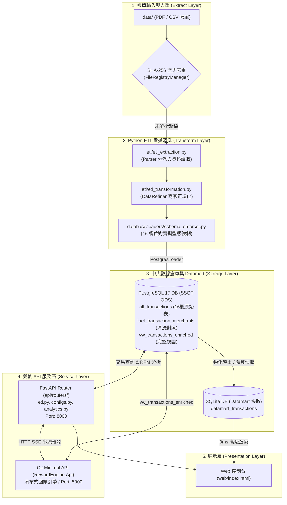

# 🗺️ 專案總架構與執行地圖 (PROJECT MAP)

本文件為專案的 **Single Source of Truth (SSOT) 核心藍圖**，記錄整體系統架構、模組職責、數據流向與開發進度。

---

## 🧭 一、 當前開發階段 (Current Phase)

```text
[ Phase 1: 基礎建立 ] ➔ [ Phase 2: 服務化與前端 ] ➔ [ Phase 3: C# 引擎重構 ] ➔ [ Phase 4: ETL & 雙軌DB ] ➔ [ Phase 5: 容器化與解耦 (DONE)]
       (DONE)                  (DONE)                   (DONE)                  (DONE)                      (DONE)
```

* **當前狀態**：`Phase 5.3 解耦重構、視圖物化與測試驗證 (DONE)`
* **主要目標**：
  * 完成 `etl/` 獨立模組化（Extraction, Transformation, Pipeline Controller）。
  * 實現 **PostgreSQL 16 欄位 SSOT 事實表**、`fact_transaction_merchants` 擴充表與 `vw_transactions_enriched` 視圖物化。
  * 重構 Web API 爲 FastAPI `APIRouter` 模組化架構 (`api/routers/`) 並直連 C# 回饋引擎。
  * 清理遺留過時模組，達成全套 pytest 單元測試 100% 通過。

---

## 📐 二、 系統現狀架構圖 (Current System Architecture)



---

## 🧩 三、 組件職責對照表 (Component Matrix)

| 模組名稱 | 主要檔案/目錄 | 職責說明 | 依賴關係 |
| :--- | :--- | :--- | :--- |
| **Extract & Parsers** | `etl/etl_extraction.py`, `etl/parsers/` | 帳單檔名掃描、SHA-256 去重比對、依 `dim_banks.yaml` 動態分派 Parser 提取原始資料。 | PDFPlumber, Pandas |
| **Transform & Refiner**| `etl/etl_transformation.py`, `etl/processors/refiner.py` | 商家名稱 SSOT 正規化 (`[支付]－[電商]－[商家]`) 與前綴拆分。 | `profiles/` |
| **ETL Pipeline Controller** | `etl/etl_api.py` | ETL 高階流程調度發起者（Facade API）。 | `etl_extraction`, `etl_transformation` |
| **Loaders (DB Abstraction)**| `database/loaders/postgres_loader.py`, `database/loaders/sqlite_loader.py` | 支援 PostgreSQL 16 欄事實表、擴充表與 `vw_transactions_enriched` 視圖自動建立。 | psycopg2, sqlalchemy |
| **Profile Configs & Sync** | `profiles/loaders/config_loader.py`, `profiles/loaders/sync_configs_to_db.py` | 管理 `dim_banks.yaml` 與個人持卡維度表，同步寫入 PostgreSQL/SQLite。 | PyYAML, Pandas |
| **RFM Analytics** | `rfm_analysis/rfm_analysis_api.py` | 全方位 RFM 客群矩陣分析、消費特徵提取與統計圖表產出。 | Pandas, NumPy |
| **C# Reward Engine** | `dotnet/RewardEngine.Core/` | 瀑布式回饋計算引擎、優先級對照、策略解析器。 | .NET 8 |
| **C# Minimal API** | `dotnet/RewardEngine.Api/` | 高併發、低延遲 HTTP SSE 串流 API (Port 5000)，直連 PG 視圖。 | RewardEngine.Core |
| **Python FastAPI Web API** | `api/server.py`, `api/routers/` | 模組化 APIRouter 路由器 (`etl.py`, `configs.py`, `analytics.py`) 與 HTTP SSE 轉發。 | FastAPI, httpx |
| **Web Console** | `web/index.html` | 前端控制台介面。 | Vanilla JS / CSS |

---

## 🔄 四、 上下文管理與開發 SOP (Context Management SOP)

為確保每次重構與修改不遺失上下文，請遵循以下步驟：

1. **查閱主地圖**：每次新增需求前，閱讀 [PROJECT_MAP.md]，確認當前所處階段 (Phase)。
2. **建立 Issue 單與 Plan**：在 `issues/` 建立 Issue 文件，並在標題註明對應的 Phase（例如 `Issue20260727 - Phase 4.3`）。
3. **更動後同步更新**：每完成一個階段，焦點更新 [PROJECT_MAP.md] 的階段狀態（將 IN PROGRESS 改為 DONE）。

---

## 📈 五、 開發里程碑紀錄

1. **✅ [Phase 5.1 & 5.2 (DONE)] 容器化與規則檔 DB 化**：
   - 已完成 Docker 三容器化（C# API, Python Worker, PostgreSQL）。
   - 已完成 `dim_banks.yaml` 規則與維度資料表同步至 PostgreSQL，C# 與 Python 皆可原生連線。
2. **✅ [Phase 5.3 (DONE)] 模組解耦重構、視圖物化與測試驗證**：
   - 將 `parsers/` 與 `processors/` 整理進入 `etl/` 模組，將 RFM 模組抽離進入 `rfm_analysis/`。
   - 完成 16 欄位 SSOT 原始事實表 `all_transactions` 與 `fact_transaction_merchants` 擴充表。
   - 完成 PostgreSQL 視圖 `vw_transactions_enriched` 的物化建置，並對齊 C# `PostgresTransactionReader.cs`。
   - 重構 Web API 爲 FastAPI `APIRouter` 模組化架構 (`api/routers/`)。
   - 完成全套 pytest 單元測試 100% PASSED (`test_card_config_loader`, `test_etl_dispatch`, `test_api_routers`)。
