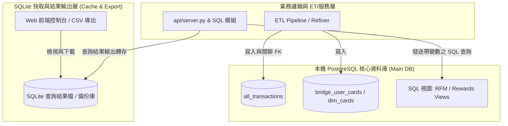
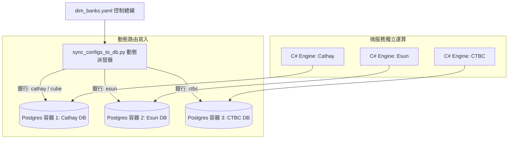

# 信用卡記帳專案資料庫架構與未來擴充規劃 (Database Architecture & Expansion Roadmap)

本文件旨在說明 `MyCreditCardProjectPro` 專案當前採用之「**PostgreSQL (主資料庫) + SQLite (查詢結果快取) 本地專案架構**」設計決策、背後的技術考量、優缺點分析，並保留專案初期「多 SQLite 獨立資料庫架構」的歷史演進脈絡與未來的擴充/遷移路線圖。

---

## 1. 當前架構：PostgreSQL (主資料庫) + SQLite (查詢結果快取) 本地專案

目前專案的核心資料庫採用「**PostgreSQL 主庫與 SQLite 本地快取輔助**」的分工設計：

* **PostgreSQL (主資料庫)**：做為單一事實來源（Single Source of Truth, SSOT），負責儲存完整交易明細表（`all_transactions`）、使用者卡片關聯（`bridge_user_cards`）、回饋規則與維度設定檔，並建立高效運算的 SQL 視圖（例如 RFM 分析母資料視圖與回饋計算母資料視圖）。
* **SQLite (查詢結果快取 / 導出庫)**：作為輔助本機庫，負責儲存從 PostgreSQL 執行 SQL 模組化查詢後的輸出結果（例如 Web 前端控制台傳入特定日期與地點變數後導出的表格快取與 CSV 檔），滿足極速本機讀取與離線隨攜需求。

---

## 2. 當前架構技術限制與組合優缺點 (PostgreSQL + SQLite 混合模式)

採用「一個 PostgreSQL + 一個 SQLite」的組合，為本地開發與分析查詢帶來了高度彈性，但也伴隨特定的技術考量：

### 💡 組合優點 (Pros)
1. **嚴格的型態系統與資料完整性 (PostgreSQL)**：
   * 原生支援 `DATE` / `TIMESTAMP`、`BOOLEAN` 與高精度 `DECIMAL` 欄位型態，解決了過往日期交集運算與外幣匯率換算時的型態轉換隱患。
   * 支援標準外鍵 (FK) 關聯約束與動態 SQL 視圖 (View)，可將複雜的 RFM 或回饋邏輯封裝在資料庫層進行高效運算。
2. **高併發寫入與標準 ACID 支援 (PostgreSQL)**：
   * 具備行級鎖 (Row-level Locking) 與完整交易機制，即時處理批量 ETL 寫入或未來多人同時操作也不會遭遇鎖庫衝突。
3. **零背景服務的檢視與隨攜性 (SQLite)**：
   * 當用戶透過前端控制台查詢並生成報告後，將結果轉存為 SQLite/CSV，使用者無需關心資料庫服務連線，單一 `.db` 或文件即可帶著走。

### ⚠️ 技術限制與考量 (Cons & Constraints)
1. **本機運行環境依賴**：
   * 相較於純 SQLite 檔案，專案環境需啟動 PostgreSQL 服務（或 Docker 容器），增加了初次部署與本機連線參數設定（如端口、帳密）的維運成本。
2. **雙庫轉換與同步機制維護**：
   * 需要維護 PostgreSQL 至 SQLite 的導出與備份腳本（如 `sqlite_back_up.py`），需確保 SQL 查詢結果導出時欄位名稱與編碼的一致性。

---

## 3. 未來擴充與升級路線圖 (Future Scaling Roadmap)

當系統未來需要升級為多人線上協同、高併發 SaaS Web 服務或是行動端 App 時，目前的架構能無縫過渡：

### 🚀 路線 A：雲端 PostgreSQL (RDS / Cloud PG) 全量無縫遷移
由於本地核心已全面採用 PostgreSQL，未來升級至雲端託管資料庫（如 AWS RDS 或 GCP Cloud SQL）無需修改任何 SQL 視圖與資料表 Schema：
* **零 Schema 修改**：視圖（RFM View、Rewards View）與外鍵關聯完整保留。
* **僅需調整連線設定**：僅需變更 `db_factory.py` / 環境變數中的 PostgreSQL 連線字串 (Connection String) 與 Connection Pool 配置，即可立即支援雲端多人同時存取。

### 🚀 路線 B：基於 `dim_banks.yaml` 驅動的多 Postgres 容器/微服務分庫藍圖 (Multi-Postgres Microservice Architecture)

當業務規模顯著擴張，需要針對特定發卡銀行進行高負載運算、實體資料庫隔離 (Multi-Tenant Physical Data Isolation) 或多團隊獨立維運時，系統可基於 `dim_banks.yaml` 與目前的 Loader / Config 模組進行微服務分庫重組：

1. **`dim_banks.yaml` 控制總線 (Single Control Plane)**：
   * `dim_banks.yaml` 作為中央服務發現與連線配置檔（包含 `bank_id`, `host`, `port`, `db_name`）。
   * 當新增銀行或調整資料庫集群時，只需更新 YAML 檔案，無須修改微服務核心程式碼。

2. **模組職責重組 (Module Refactoring Strategy)**：
   * **[config_loader.py](./profiles/loaders/config_loader.py)**：負責 YAML / CSV 配置檔的讀取、雙層 Profile 疊加與 SSOT 文字型態防呆。
   * **[db_columns_mapping.py](./profiles/loaders/db_columns_mapping.py)**：提供跨資料庫的欄位映射與 PostgreSQL / SQLite DDL 對齊。
   * **[sync_configs_to_db.py](./profiles/loaders/sync_configs_to_db.py)**：轉型為動態派發器 (Dynamic Dispatcher)，依據 `dim_banks.yaml` 中的銀行清單，自動將特定銀行的規則（如 `bridge_reward_rules`, `bridge_cube_selections`）派發至對應的獨立 PostgreSQL 容器。

3. **微服務獨立縮放與物理隔離 (Physical Data Isolation)**：
   * 每家銀行可擁有獨立的 **Postgres 容器 + C# 回饋運算 Engine 容器**。
   * 某家銀行的權益切換規則更新或大流量算力需求，完全被限定在該銀行的實體容器內部，達成零耦合與極致彈性。

---

## 4. 初期採用方案：多 SQLite 獨立資料庫設計與初期架構技術限制

在專案演進至 PostgreSQL 主庫之前，本專案初期曾採用「**多 SQLite 獨立資料庫設計 (Multi-SQLite Architecture)**」。在此記錄初期的設計考量與技術限制，作為系統架構變更的歷史脈絡：

### 1️⃣ 初期多 SQLite 架構設計
初期專案將資料切分至三個獨立的 SQLite 實體檔案（`TransactionsBills.db`、`TransactionsConfigs.db`、`TransactionsAnalysis.db`）。
* **當初之設計考量**：
  * **上手成本最低 (Developer Familiarity)**：讓開發資源能 100% 專注於「瀑布式回饋計算引擎」的業務邏輯，避免被資料庫維運分心。
  * **零配置與攜帶方便 (Zero-Configuration)**：無背景服務，專案資料夾打包即可在任何 Python 環境運作。
  * **本機讀寫極速 (High Performance Local I/O)**：免去網路通訊開銷，本機批量讀寫速度極快。

### 2️⃣ 初期架構的技術限制與升級驅動力
隨著系統擴充與視圖需求增加，多 SQLite 架構暴露出以下瓶頸，成為推動轉向 PostgreSQL 主庫的關鍵：
* **連線與跨庫復原複雜 (Connection & Transaction Limits)**：三個資料庫獨立存在，無法以單一原生 Connection 執行跨庫寫入與分散式交易復原 (Distributed Rollback)。
* **併發寫入鎖定 (Concurrency / File-level Lock)**：SQLite 採用檔案級鎖，同一時間僅能單一 Process 寫入，無法承受多任務或線上控制台的平行寫入需求。
* **鬆散型態系統 (Loose Typing System)**：SQLite 缺乏原生 `DATE` 與 `BOOLEAN` 型態，依賴 `TEXT` 儲存導致日期交集運算必須在 Python 層額外進行防護強制轉型（如 `datetime64[ns]`），增加了引擎崩潰的風險。

---

## 5. 結語：尊重演進、架構彈性

「**熟悉的工具助您快速起步，良好的架構讓您從容演進。**」

從初期的「多 SQLite 獨立資料庫」演進至當前的「PostgreSQL 主資料庫 + SQLite 查詢結果快取」，反映了專案對業務需求與資料庫效能平衡的持續追求。

本專案在 Python Service 服務層（如 `services/`）與 Loader 模式上始終保持介面純粹性與 pandas DataFrame 的中介資料流設計。不論是當前本機的 PostgreSQL + SQLite 組合，或是未來的雲端 SaaS 遷移，系統都能以最小代碼變動量完成升級，確保長期發展的極致彈性！
